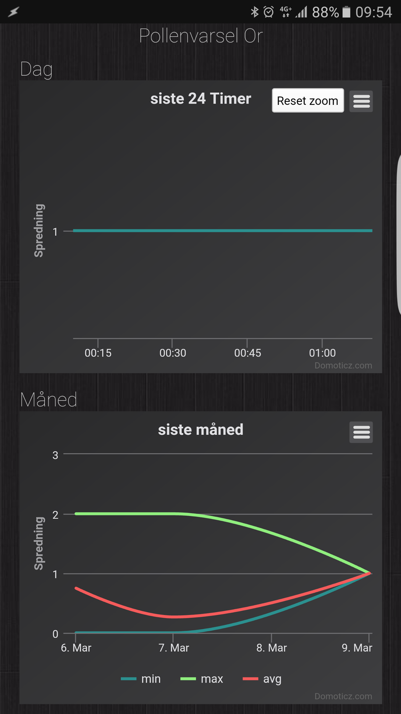

This is a Powershell script for updating virtual "dummy" devices in Domoticz home automation system (http://domoticz.com/) with pollen forcast info from pollenvarslingen.no.
This can be useful if you are allergic to pollen.
Forecast is for today, and tomorrow.

To get this script to work you also need Html Agility Pack that can be downloaded here: https://htmlagilitypack.codeplex.com/
The source website is updating every midnight (Central European Time/Central European Summer Time). I therefore recommend that this script runs just after midnight once a day.
This can be done with Windows Task Scheduler. The script don't have to be on the same server as Domoticz.

A custom sensor will be updated with a value from 0-4 (so Domoticz can create a graph)

**Value descriptions**
- 0 = Ingen spredning / No proliferation
- 1 = Beskjeden spredning / Modest proliferation
- 2 = Moderat spredning / Moderate proliferation
- 3 = Kraftig spredning / Powerful proliferation
- 4 = Ekstrem spredning / Extreme proliferation

**Avaiable locations**
- Østlandet med Oslo
- Sørlandet
- Rogaland
- Hordaland
- Sogn og Fjordane
- Møre og Romsdal
- Indre Østlandet
- Sentrale fjellstrøk i Sør-Norge
- Trøndelag
- Nordland
- Troms
- Finnmark

**Avaiable Types of Pollen**
- Or / Alder - https://en.wikipedia.org/wiki/Alder
- Hassel / Hazel - https://en.wikipedia.org/wiki/Hazel
- Salix / Willow - https://en.wikipedia.org/wiki/Willow
- Bjørk / Birch - https://en.wikipedia.org/wiki/Birch
- Gress / Grass - https://en.wikipedia.org/wiki/Poaceae
- Burot / Mugwort - https://en.wikipedia.org/wiki/Mugwort

